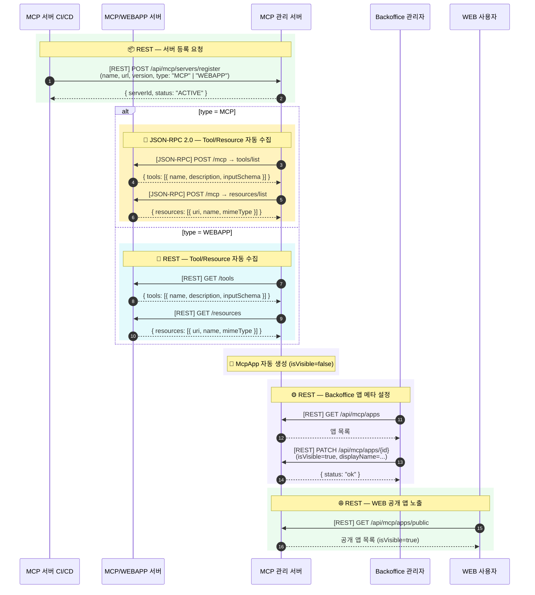
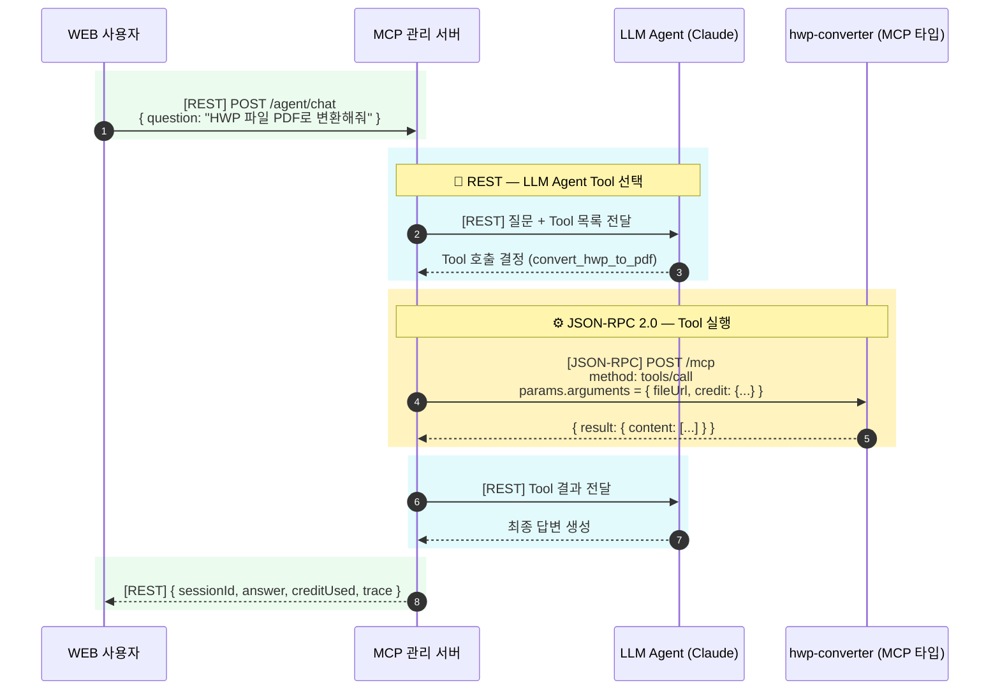
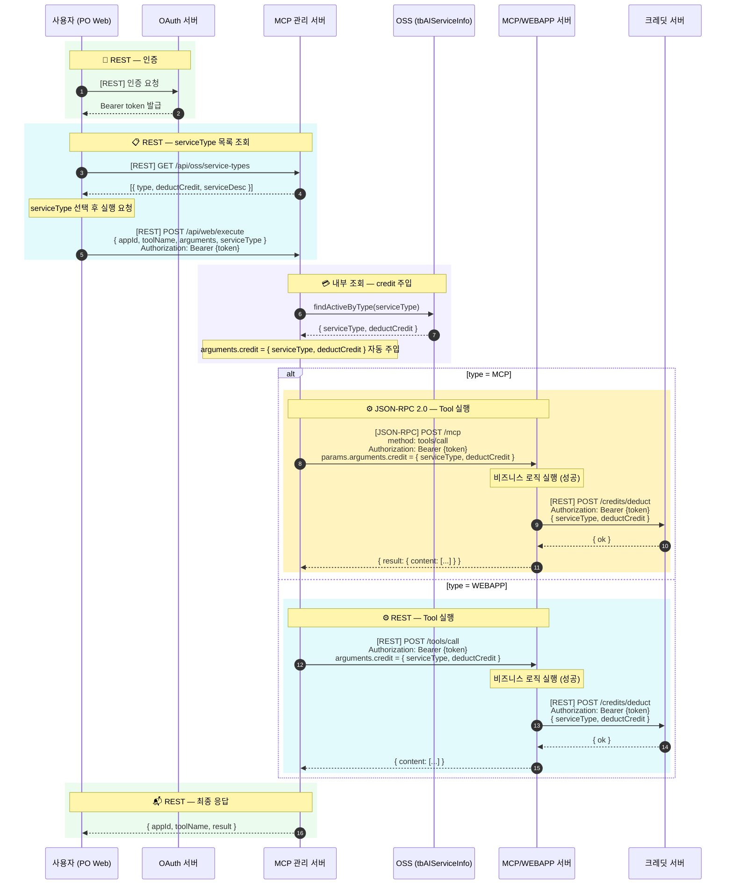

# MCP 관리 서버 시퀀스 다이어그램

> **색상 범례**  
> 🟡 노란 배경 = **JSON-RPC 2.0** 통신  
> 🔵 파란 배경 = **REST HTTP** 통신  
> 🟢 초록 배경 = 일반 HTTP  
> 🟣 보라 배경 = 내부 처리

---

## Flow 1: MCP 서버 등록 → Backoffice 설정 → WEB 공개

---

## Flow 2: 사용자 Tool 실행 (Agent 경유)

---

## Flow 3: PO Web 직접 실행 → credit 주입 → MCP/WEBAPP 서버 차감

> **JSON-RPC 2.0**: 단일 엔드포인트 `POST /mcp`에 `method` 필드로 라우팅  
> **REST**: 엔드포인트 자체가 메서드 역할 (`GET /tools`, `POST /tools/call`)  
> **`arguments.credit`**: MCP 관리 서버가 자동 주입 — MCP/WEBAPP 서버 모두 동일하게 수신
