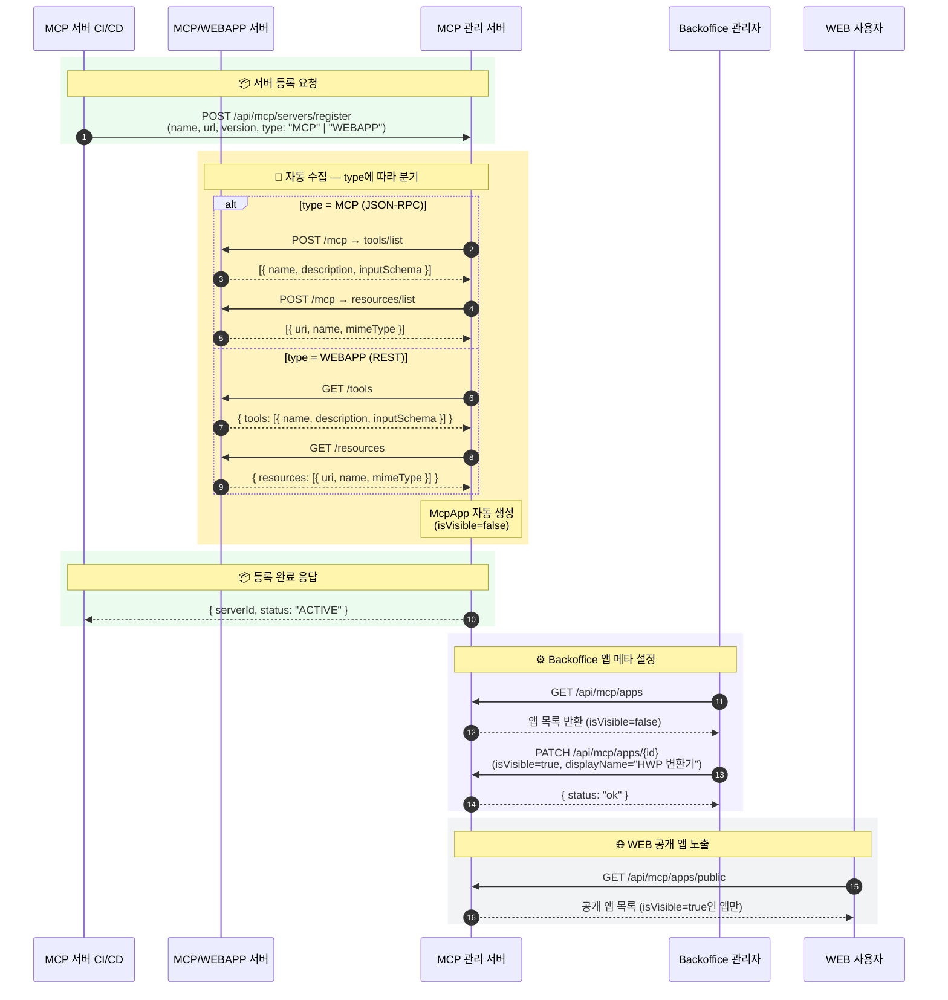
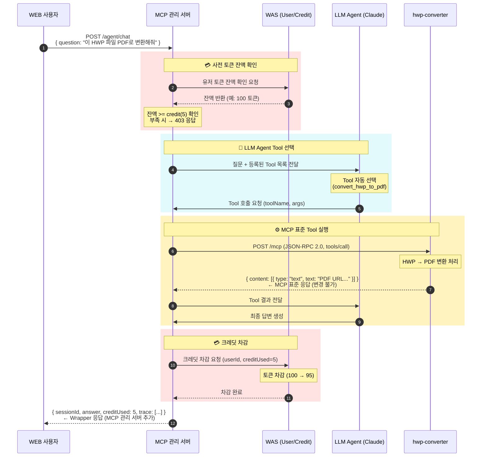
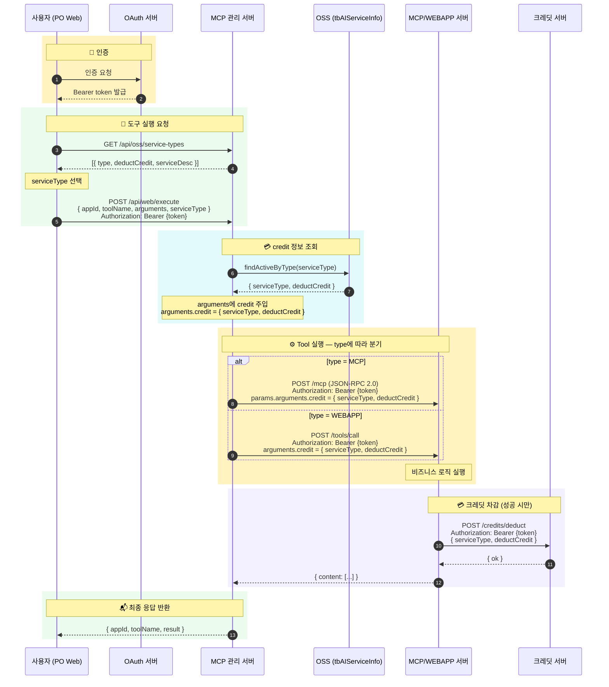

# MCP 관리 서버 시퀀스 다이어그램

---

## Flow 1: MCP 서버 등록 → Backoffice 설정 → WEB 공개

> **범례**: 실선(`->>`) = 요청/호출 · 점선(`-->>`) = 응답/반환

---

## Flow 2: 사용자 Tool 실행 → 크레딧 차감

> **범례**: 실선(`->>`) = 요청/호출 · 점선(`-->>`) = 응답/반환  
> `← MCP 표준 응답` = MCP JSON-RPC 2.0 원본 구조 (변경 불가)  
> `← Wrapper 응답` = MCP 관리 서버가 감싸는 상위 객체

---

## Flow 3: PO Web 실행 → credit 주입 → MCP 서버 차감

> **사용자 식별**: Bearer 토큰을 MCP 서버까지 그대로 전달. MCP 서버가 토큰으로 크레딧 서버에 사용자 특정.  
> **credit 주입**: MCP 관리 서버가 자동 처리. MCP/WEBAPP 서버 둘 다 `arguments.credit`으로 동일하게 수신.

