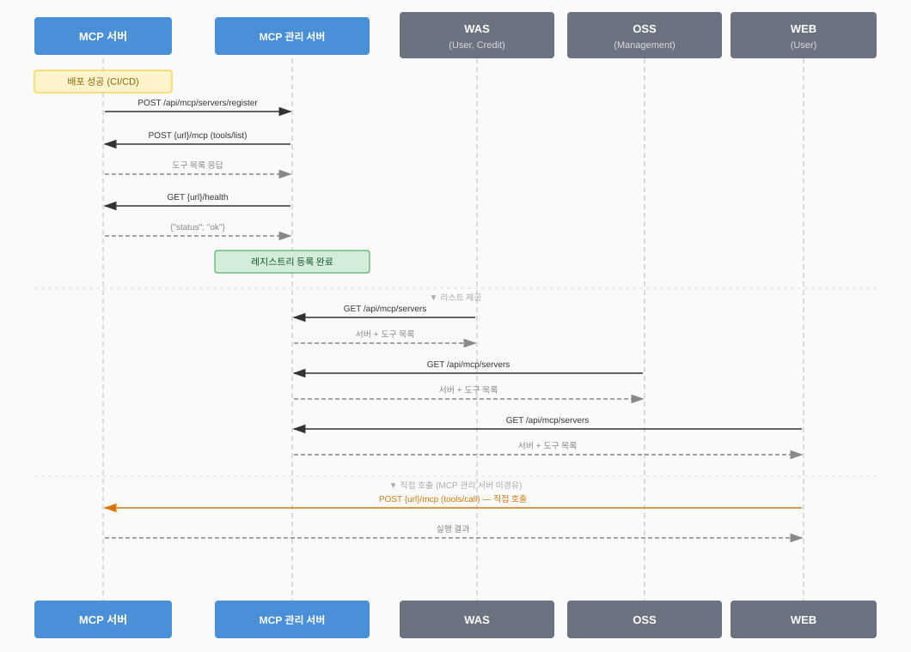

# MCP 관리 서버 통신 규약 v0.6

이 문서는 **MCP 관리 서버에 등록하려는 MCP 서버 개발자**를 대상으로 한다.
MCP 관리 서버에 등록하기 위해 MCP 서버가 구현해야 할 엔드포인트와 통신 규약을 정의한다.

---

## 1. 기반 표준

본 규약은 **Model Context Protocol (MCP) 공식 표준 Specification `2024-11-05`** 에 의거한다.

- 공식 스펙: https://modelcontextprotocol.io
- 전송 방식: **Streamable HTTP** (본 구현은 동기 HTTP POST 단순화 방식 사용)
- 메시지 포맷: **JSON-RPC 2.0**

### MCP 표준 프리미티브

| 프리미티브 | 설명 | 본 규약 사용 여부 |
|---|---|---|
| **Tools** | LLM 또는 클라이언트가 호출하는 함수 | 사용 |
| **Resources** | 서버가 노출하는 데이터·파일 | 사용 (등록 시 수집, image/* 는 썸네일 자동 추출) |
| **Prompts** | 서버가 제공하는 프롬프트 템플릿 | 미사용 |

### JSON-RPC 2.0 메시지 포맷

**요청**
```json
{
  "jsonrpc": "2.0",
  "id": 1,
  "method": "tools/list",
  "params": {}
}
```

**정상 응답**
```json
{
  "jsonrpc": "2.0",
  "id": 1,
  "result": {}
}
```

**에러 응답**
```json
{
  "jsonrpc": "2.0",
  "id": 1,
  "error": {
    "code": -32601,
    "message": "Method not found"
  }
}
```

| 에러 코드 | 의미 |
|---|---|
| -32600 | Invalid Request |
| -32601 | Method not found |
| -32602 | Invalid params |
| -32603 | Internal error |

---

## 2. MCP 서버 구현 요건

MCP 관리 서버에 등록하려면 아래 두 엔드포인트를 반드시 노출해야 한다.

| 엔드포인트 | 메서드 | 필수 여부 | 설명 |
|---|---|---|---|
| `/health` | GET | 필수 | 서버 상태 확인. MCP 관리 서버가 60초마다 폴링 |
| `/mcp` | POST | 필수 | JSON-RPC 2.0 처리 |

### GET /health

**Response**
```json
{ "status": "ok" }
```

### POST /mcp — tools/list

등록 시 MCP 관리 서버가 1회 자동 호출한다. **반드시 1개 이상의 Tool을 반환해야 한다.**

**Request**
```json
{
  "jsonrpc": "2.0",
  "id": 1,
  "method": "tools/list",
  "params": {}
}
```

**Response**
```json
{
  "jsonrpc": "2.0",
  "id": 1,
  "result": {
    "tools": [
      {
        "name": "get_current_weather",
        "description": "도시의 현재 날씨를 조회합니다.",
        "inputSchema": {
          "type": "object",
          "properties": {
            "city": { "type": "string", "description": "도시 이름" }
          },
          "required": ["city"]
        }
      }
    ]
  }
}
```

### POST /mcp — tools/call

**Request**
```json
{
  "jsonrpc": "2.0",
  "id": 1,
  "method": "tools/call",
  "params": {
    "name": "get_current_weather",
    "arguments": {
      "city": "서울",
      "credit": {
        "serviceType": 2,
        "deductCredit": 50
      }
    }
  }
}
```

`credit` 필드는 MCP 관리 서버가 자동으로 주입한다. 사용자가 실행 시 선택한 `serviceType`에 해당하는 차감 크레딧 값이 담긴다. MCP 서버는 실행 성공 여부에 따라 이 값을 OSS 크레딧 서버에 전달해야 한다. (`arguments.credit`을 꺼내 사용하면 된다.)

**Response**
```json
{
  "jsonrpc": "2.0",
  "id": 1,
  "result": {
    "content": [
      { "type": "text", "text": "[서울 현재 날씨] 온도: 25°C ..." }
    ]
  }
}
```

### POST /mcp — resources/list

선택 구현. 미구현이거나 빈 배열을 반환해도 등록 실패로 처리하지 않는다.
`mimeType: image/*` 리소스가 있으면 MCP 관리 서버가 썸네일로 자동 추출한다.

**Response**
```json
{
  "jsonrpc": "2.0",
  "id": 1,
  "result": {
    "resources": [
      {
        "uri": "image://logo.png",
        "name": "App Logo",
        "description": "앱 대표 이미지",
        "mimeType": "image/png"
      }
    ]
  }
}
```

| 필드 | 필수 | 설명 |
|---|---|---|
| `uri` | O | 리소스 고유 식별자 |
| `name` | O | 사람이 읽을 수 있는 이름 |
| `description` | 선택 | 리소스 설명 |
| `mimeType` | 선택 | `image/*` 이면 썸네일 자동 추출 |

### POST /mcp — resources/read

`resources/list`를 구현했다면 함께 구현한다.

**Request**
```json
{
  "jsonrpc": "2.0",
  "id": 1,
  "method": "resources/read",
  "params": { "uri": "image://logo.png" }
}
```

**Response** (`blob`: base64 인코딩)
```json
{
  "jsonrpc": "2.0",
  "id": 1,
  "result": {
    "contents": [
      {
        "uri": "image://logo.png",
        "mimeType": "image/png",
        "blob": "base64encodeddata..."
      }
    ]
  }
}
```

---

## 3. WEBAPP 서버 구현 요건

`type=WEBAPP`으로 등록하는 서버는 MCP JSON-RPC 대신 아래 REST 엔드포인트를 노출해야 한다.
**응답 데이터 구조는 MCP 표준과 동일**하며, JSON-RPC 래퍼(`jsonrpc`, `id`, `result`)만 제거한 형태다.

| 엔드포인트 | 메서드 | 필수 여부 | 설명 |
|---|---|---|---|
| `/health` | GET | 필수 | 서버 상태 확인. MCP 관리 서버가 60초마다 폴링 |
| `/tools` | GET | 필수 | Tool 목록 및 파라미터 스키마 반환. 등록 시 1회 자동 호출 |
| `/tools/call` | POST | 필수 | Tool 실행 |
| `/resources` | GET | 선택 | Resource 목록 반환 |
| `/resources/read` | GET | 선택 | Resource 내용 반환 (`uri` 쿼리 파라미터) |

### GET /health

MCP 서버와 동일.

**Response**
```json
{ "status": "ok" }
```

### GET /tools

등록 시 MCP 관리 서버가 1회 자동 호출한다. **반드시 1개 이상의 Tool을 반환해야 한다.**

**Response**
```json
{
  "tools": [
    {
      "name": "convert_hwp",
      "description": "HWP 파일을 PDF로 변환합니다.",
      "inputSchema": {
        "type": "object",
        "properties": {
          "fileUrl": { "type": "string", "description": "변환할 HWP 파일 URL" }
        },
        "required": ["fileUrl"]
      }
    }
  ]
}
```

MCP `tools/list` 응답의 `result.tools` 배열과 동일한 구조다.

### POST /tools/call

**Request**
```json
{
  "name": "convert_hwp",
  "arguments": {
    "fileUrl": "https://example.com/doc.hwp",
    "credit": {
      "serviceType": 2,
      "deductCredit": 50
    }
  }
}
```

MCP `tools/call` 요청의 `params` 객체와 동일한 구조다.  
`credit` 필드는 MCP 관리 서버가 자동으로 주입한다. MCP 타입과 동일하게 `arguments.credit`을 꺼내 OSS 크레딧 서버에 전달하면 된다.

**Response**
```json
{
  "content": [
    { "type": "text", "text": "변환 완료. 다운로드 URL: https://..." }
  ]
}
```

MCP `tools/call` 응답의 `result` 객체와 동일한 구조다.

### GET /resources

선택 구현. 미구현이거나 빈 배열을 반환해도 등록 실패로 처리하지 않는다.
`mimeType: image/*` 리소스가 있으면 MCP 관리 서버가 썸네일로 자동 추출한다.

**Response**
```json
{
  "resources": [
    {
      "uri": "image://logo.png",
      "name": "App Logo",
      "description": "앱 대표 이미지",
      "mimeType": "image/png"
    }
  ]
}
```

MCP `resources/list` 응답의 `result` 객체와 동일한 구조다.

### GET /resources/read?uri={uri}

`/resources`를 구현했다면 함께 구현한다.

**Response** (`blob`: base64 인코딩)
```json
{
  "contents": [
    {
      "uri": "image://logo.png",
      "mimeType": "image/png",
      "blob": "base64encodeddata..."
    }
  ]
}
```

MCP `resources/read` 응답의 `result` 객체와 동일한 구조다.

---

## 4. 등록 흐름


> 첨부 파일: `sequcneflow.svg`

MCP 서버를 MCP 관리 서버에 등록하면 아래 순서로 자동 처리된다.

**type=MCP**

| 순서 | 동작 | 필수 여부 | 실패 시 |
|---|---|---|---|
| ① | `POST /mcp` → `tools/list` 호출 → Tool 수집 | 필수 | `REGISTRATION_FAILED` 처리 후 종료 |
| ② | `POST /mcp` → `resources/list` 호출 → Resource 수집 | 선택 | 무시하고 정상 진행 |
| ③ | 이후 `GET /health` 60초 주기 폴링 시작 | 필수 | 3회 연속 실패 시 `INACTIVE` |

**type=WEBAPP**

| 순서 | 동작 | 필수 여부 | 실패 시 |
|---|---|---|---|
| ① | `GET /tools` 호출 → Tool 수집 | 필수 | `REGISTRATION_FAILED` 처리 후 종료 |
| ② | `GET /resources` 호출 → Resource 수집 | 선택 | 무시하고 정상 진행 |
| ③ | 이후 `GET /health` 60초 주기 폴링 시작 | 필수 | 3회 연속 실패 시 `INACTIVE` |

**등록 API**

```
POST /api/mcp/servers/register
Content-Type: application/json

{
  "name": "my-mcp-server",
  "url": "https://my-mcp.example.com",
  "description": "서버 설명",
  "version": "1.0.0",
  "type": "MCP"
}
```

| 필드 | 필수 | 설명 |
|---|---|---|
| `name` | O | 서버 등록명 |
| `url` | O | MCP 서버 Base URL (`/mcp`, `/health` 경로 제외한 루트) |
| `description` | 선택 | 서버 설명 |
| `version` | 선택 | 서버 버전 |
| `type` | 선택 | `MCP` (기본값) / `WEBAPP`. `MCP`이면 JSON-RPC `/mcp` 통신, `WEBAPP`이면 REST `/tools`, `/tools/call` 통신 |

**Response**
```json
{
  "serverId": "550e8400-e29b-41d4-a716-446655440000",
  "status": "ACTIVE"
}
```

---

## 5. ServerStatus

| 값 | 설명 |
|---|---|
| `PENDING` | 등록 요청 수신, 수집 진행 중 |
| `ACTIVE` | 정상 등록 완료 및 헬스체크 통과 |
| `INACTIVE` | 헬스체크 3회 연속 실패 |
| `REGISTRATION_FAILED` | tools/list 실패 또는 빈 배열 반환 |

---

## 6. 헬스체크 사이클

등록 완료 후 MCP 관리 서버가 60초마다 `GET /health`를 폴링한다.

```
MCP 관리 서버 ──── GET {serverUrl}/health ──── 60초마다
                       200 OK  →  ACTIVE 유지
                       3회 연속 실패  →  INACTIVE
                       이후 복구 확인  →  ACTIVE 자동 전환
```

---

## 7. 재등록

동일 URL로 재등록 요청 시 신규 생성이 아닌 업데이트로 처리한다.
배포 파이프라인 마지막 스텝에 등록 호출을 추가하는 것을 권장한다.

| 항목 | 동작 |
|---|---|
| `serverId` | 기존 ID 재사용 |
| `tools` / `resources` | 재수집하여 최신 상태로 덮어씀 |
| `registeredAt` | 최초 등록 시각 유지 |

**GitHub Actions 예시**
```yaml
- name: Register MCP server
  run: |
    curl -X POST https://mcp-manager/api/mcp/servers/register \
      -H "Content-Type: application/json" \
      -d '{"name":"my-mcp","url":"https://my-mcp.example.com","version":"1.0.0","type":"MCP"}'
```

---

## 8. (선택) 표준 Streamable HTTP 서버 연결

표준 MCP Streamable HTTP 서버는 `GET /health`가 없고 SSE 응답을 포함할 수 있어 직접 등록이 불가하다.
이 경우 얇은 어댑터를 두어 간극을 메울 수 있다.

| 항목 | 표준 MCP 서버 | 어댑터가 처리 |
|---|---|---|
| `GET /health` | 없음 | 항상 200 반환 |
| `Accept` 헤더 | `application/json, text/event-stream` 필요 | 자동 설정 |
| SSE 응답 | SSE 스트림 | JSON으로 파싱 변환 |

```
MCP 관리 서버 → 어댑터 (로컬) → 표준 MCP 서버 (원격)
```

---

## 9. Credit 처리

사용자가 PO Web에서 도구를 실행할 때 `serviceType`을 선택한다.  
MCP 관리 서버는 해당 serviceType에 맞는 `deductCredit` 값을 조회해 `arguments.credit`에 자동 주입한다.

**MCP 서버가 해야 할 일**

1. `arguments.credit`에서 `serviceType`, `deductCredit` 추출
2. 도구 실행
3. 실행 **성공** 시 → OSS 크레딧 서버에 차감 요청
4. 실행 **실패** 시 → 차감 없음

```python
# Python 예시
def call_tool(name, args):
    credit = args.pop("credit", None)   # credit 분리, 비즈니스 로직에는 전달 안 함
    result = execute_business_logic(name, args)
    if result["success"] and credit:
        deduct_credit(credit["serviceType"], credit["deductCredit"])
    return result
```

**인증 (사용자 식별)**

크레딧 차감 시 사용자 식별은 요청 헤더의 Bearer 토큰으로 처리한다.  
MCP 관리 서버가 `Authorization: Bearer {token}` 헤더를 그대로 전달하므로, MCP 서버는 이 토큰을 OSS 크레딧 서버에 함께 전달하면 된다.

| 항목 | 전달 방식 |
|---|---|
| 사용자 식별 | `Authorization: Bearer {token}` 헤더 |
| 크레딧 정보 | `arguments.credit.serviceType`, `arguments.credit.deductCredit` |

---

## 비고

- MCP 공식 스펙: https://modelcontextprotocol.io
- 인증 방식은 현재 미확정. 확정되면 `tools/call` 요청에 인증 헤더가 추가될 수 있으며, 이에 따라 MCP 서버의 처리 방식도 달라질 수 있다.
